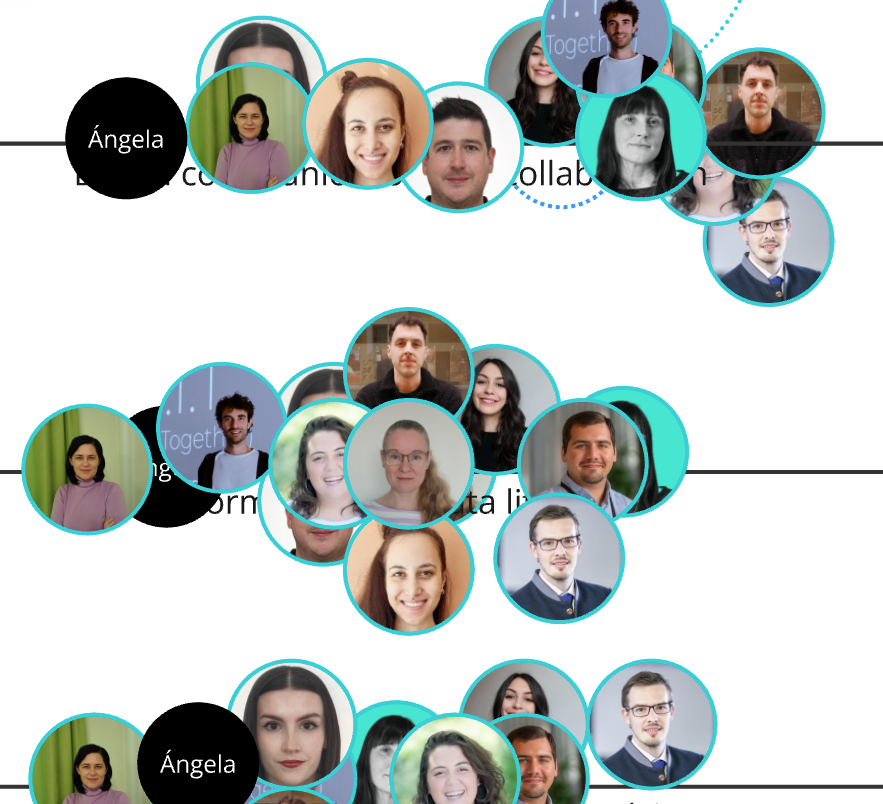
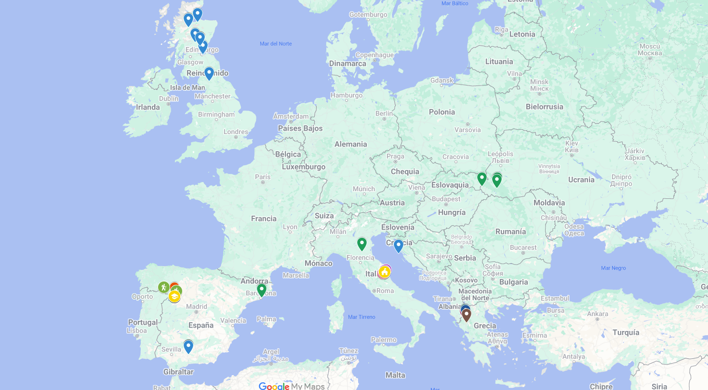
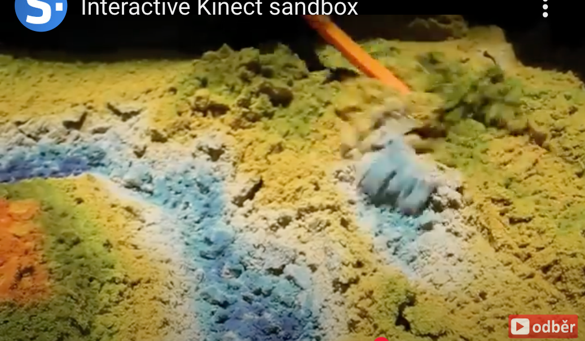
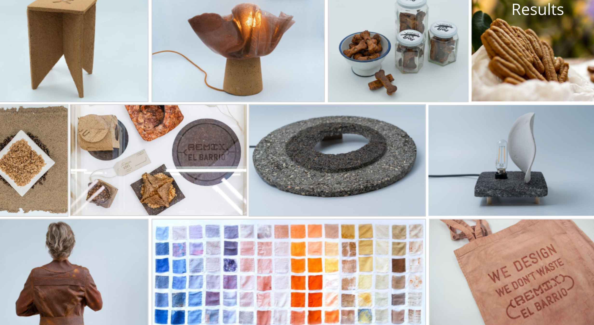
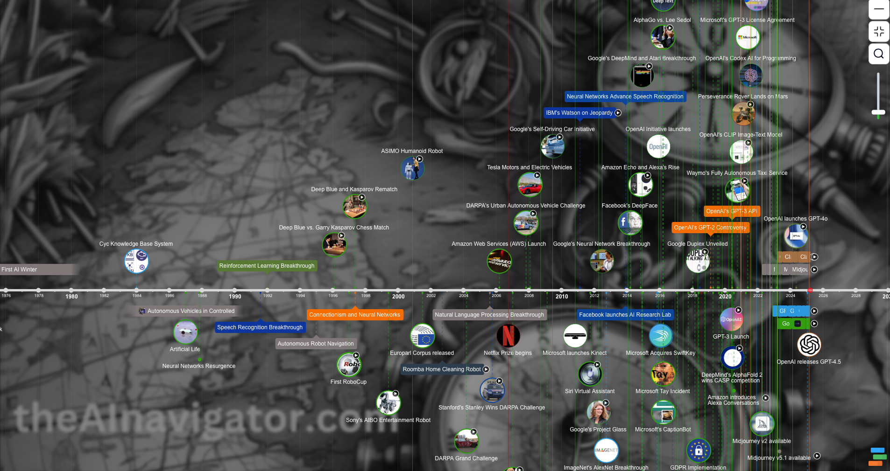
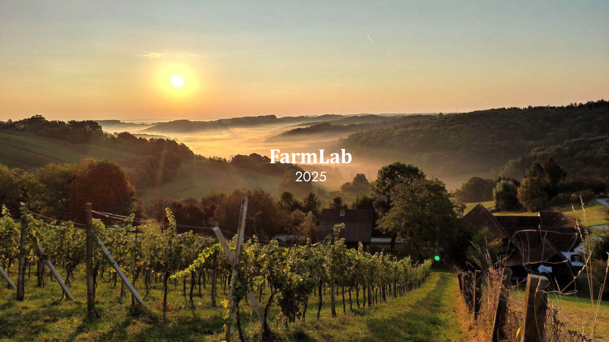

---
hide:
  - navigation
  - toc
---

# Ruractive Train of Trainers

<!-- Agrega este código a tu archivo .md -->

  

    
    

      <h2 class="title">SESSION 0</h2>
      
Welcome & Kickoff

    

    <a href="sessions/00" class="card-link">Ir a la sesión</a>
  

  

    
    

      <h2 class="title">SESSION 1</h2>
      
Information and data literacy

    

    <a href="sessions/01" class="card-link">Ir a la sesión</a>
  

  

    
    

      <h2 class="title">SESSION 2</h2>
      
Digital technologies for rapid prototyping

    

    <a href="sessions/02" class="card-link">Ir a la sesión</a>
  

  

    
    

      <h2 class="title">SESSION 3</h2>
      
Digital communication and collaboration

    

    <a href="sessions/03" class="card-link">Ir a la sesión</a>
  

  

    
    

      <h2 class="title">SESSION 4</h2>
      
Information and data literacy, Artificial Intelligence (AI)

    

    <a href="sessions/04" class="card-link">Ir a la sesión</a>
  

  

    
    

      <h2 class="title">SESSION 5</h2>
      
Digital Content Creation, Digital tech + Dataviz

    

    <a href="sessions/05" class="card-link">Ir a la sesión</a>
  

  

    
    

      <h2 class="title">SESSION 6</h2>
      
Sustainable Innovation, Digital Tools and Maker Practices

    

    <a href="sessions/tbd" class="card-link">Ir a la sesión</a>
  

  

    
    

      <h2 class="title">SESSION 7</h2>
      
Knowlage transfer workshop

    

    <a href="sessions/tbd" class="card-link">Ir a la sesión</a>
  

Made with :purple_heart: from Fablab Barcelona :hammer_and_wrench: