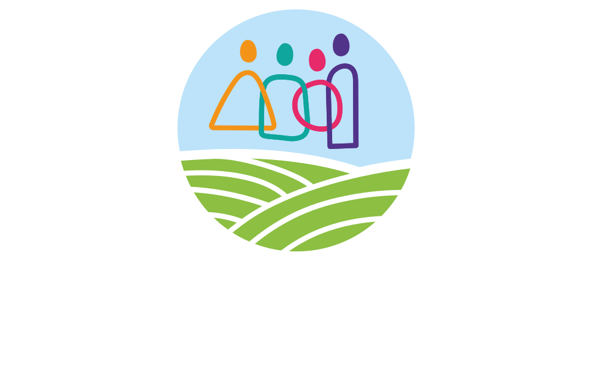
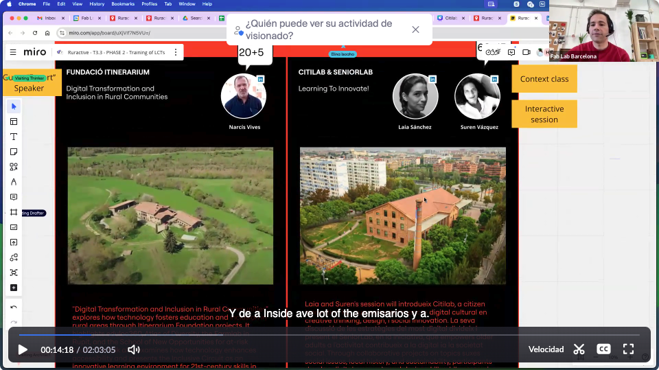

---
hide:
  - navigation
  - toc
---

# Ruractive Train of Trainers

  
  

    <h2 class="title">Session 0</h2>
    
Session description text here

  

  <a href="sessions/00.md" class="card-link">Ir a la sesión</a>

  
  

    <h2 class="title">Session 1</h2>
    
More description text here

  

  <a href="sessions/01.md" class="card-link">Ir a la sesión</a>

  
  

    <h2 class="title">Session 2</h2>
    
More description text here

  

  <a href="sessions/02.md" class="card-link">Ir a la sesión</a>

Made with :purple_heart: from Fablab Barcelona :hammer_and_wrench: