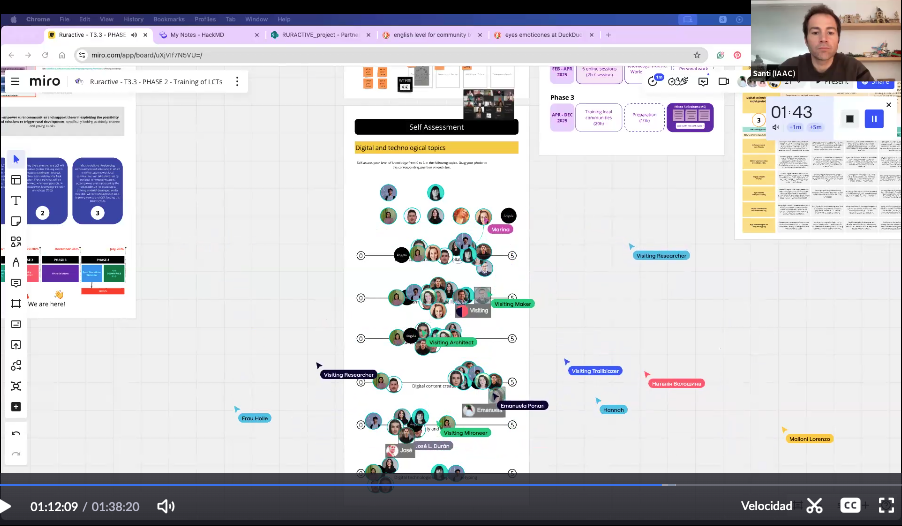

# SESSION 0

## Introduction to Ruractive and the Local Comunity Training

Access code: srW1=j=f

## Task 0

!!! warning "Mapping Your Local Training Ecosystem"
   
     In the first task, you will connect with your Local Task Force (LTF) and collaboratively, map the communities target groups you may engage with in your local training sessions.

    

     This exercise will help you better understand the local context, identify key stakeholders, and assess the needs of different groups.

    1. Meet Your Local Task Force (LTF)
        - If you are working with a team or organization, schedule a meeting to discuss your shared goals and expertise.

    2. Identify Target Groups
        - List the communities, organizations, or individuals who could benefit from the training. Consider schhols, NGO's, professional groups, underserved communities or local institutions.

    3. Analyze Strengths and Needs
      - Briefly outline the specific challenges, needs, and interests of these groups in relation to the training you will provide.

    4. Create your own personal webpage.

    5. Document the process in your personal webpage.

