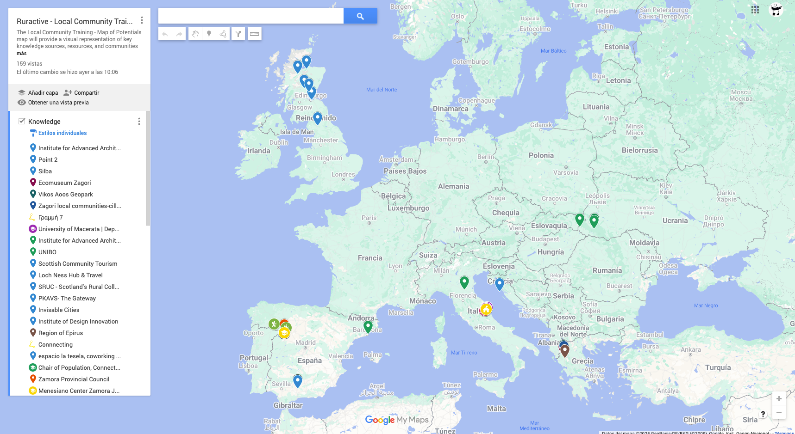

# SESSION 1

## Information and data literacy

## Task 1

!!! warning "Mapping of Potentials"

    

    This task will help you identify and geolocate potential knowledge sources, resources, and communities that can support your local training initiatives. You will use Google My Maps to create a shared, visual representation of available opportunities.
   
    **Categories to Map:**

      - Knowledge: Add institutions, reference projects, or experts that could provide educational content.

      - Resources: Identify available materials, tools, community spaces, or organizations that can support your training.

      - Communities (Target Group): Pin local and global communities, interest groups, or networks relevant to your initiative.

    - [Google Maps](https://www.google.com/maps/d/u/1/edit?hl=es&mid=1VNGnpujK-CbaG1nq4f_k0g-avfMPig0&ll=47.35089620847364%2C5.024316569747356&z=5)

