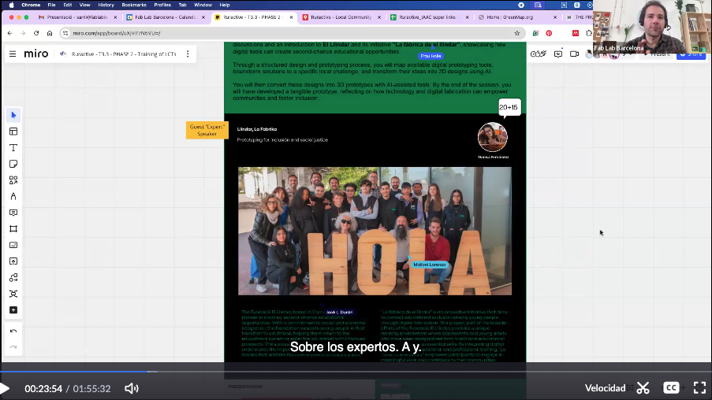
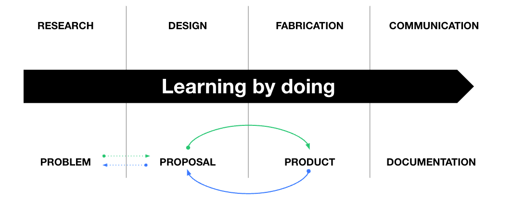

# SESSION 2

## Digital technologies for rapid prototyping

**Access code: ^09jpQ4F**

## Task 2 

!!! warning "Prototype a solution to a challenge you have identified in your local community"

    
    
    In this task, repeat the process by focusing on a local challenge in your rural community. Think about reallife issues that elderly people, youth, or women face due to the digital divide. Identify a specific problem, brainstorm how digital technologies and rapid prototyping could help, and develop a simple prototype using 2D or 3D tools.
    

