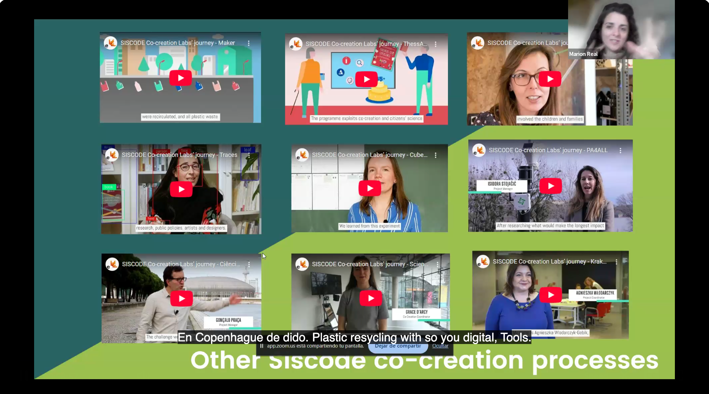
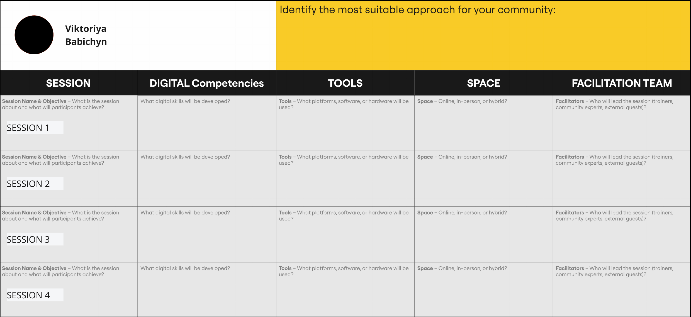

# SESSION 3

## Co-Creation and Innovation

## Task 3 

!!! warning "Designing Your Training Path"

    
    
    This week, your task is to finalize and document your training session plan in HackMD.

    🔹 What to Do?

        Choose your Training Mode: Challenge, Independent, or Hybrid.

    Complete your 4-Session Plan, detailing:

        ✅ Competencies to develop

        🛠️ Tools to use

        📍 Space (online, in-person, hybrid)
        
        👩‍🏫 Facilitators involved
    

