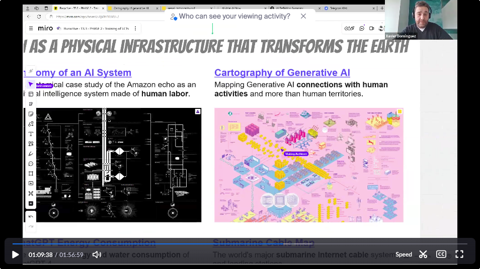
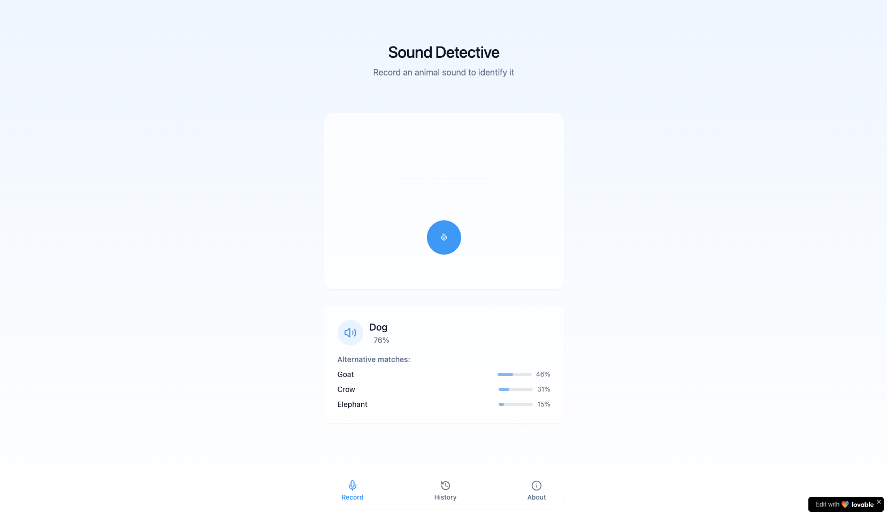

# SESSION 4

## Artificial Intelligence (Al) literacy

## Task 4 

!!! warning "Prototype an AIdea"

    

    [Ex: animal-sound-detective](https://animal-sound-detective.lovable.app/)

    
    **Explore any Al tool and Prototype an idea/project/app.**
    Document the process and share your prompts in your Hackmd.

