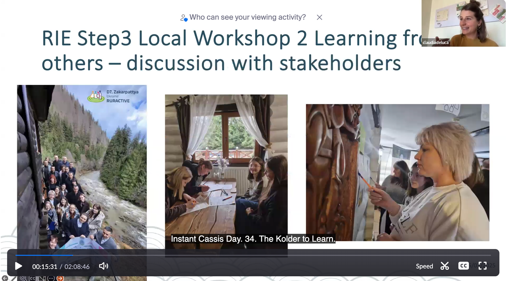
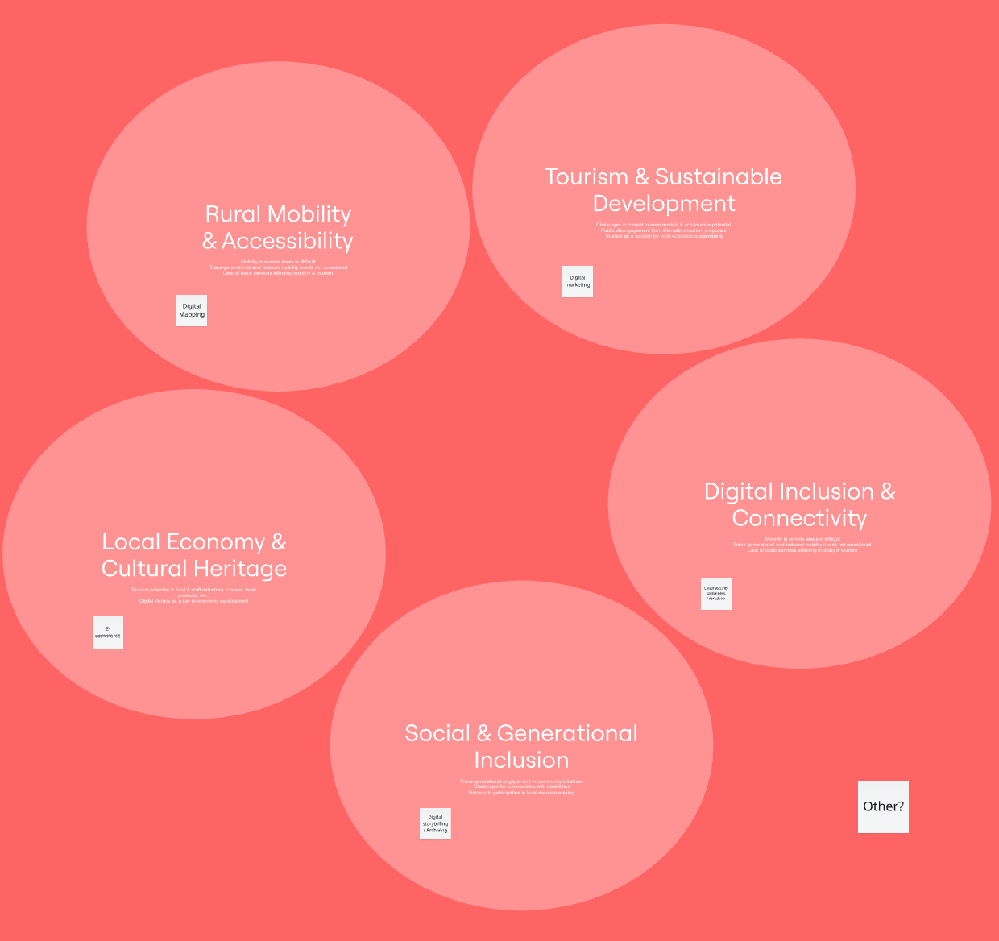
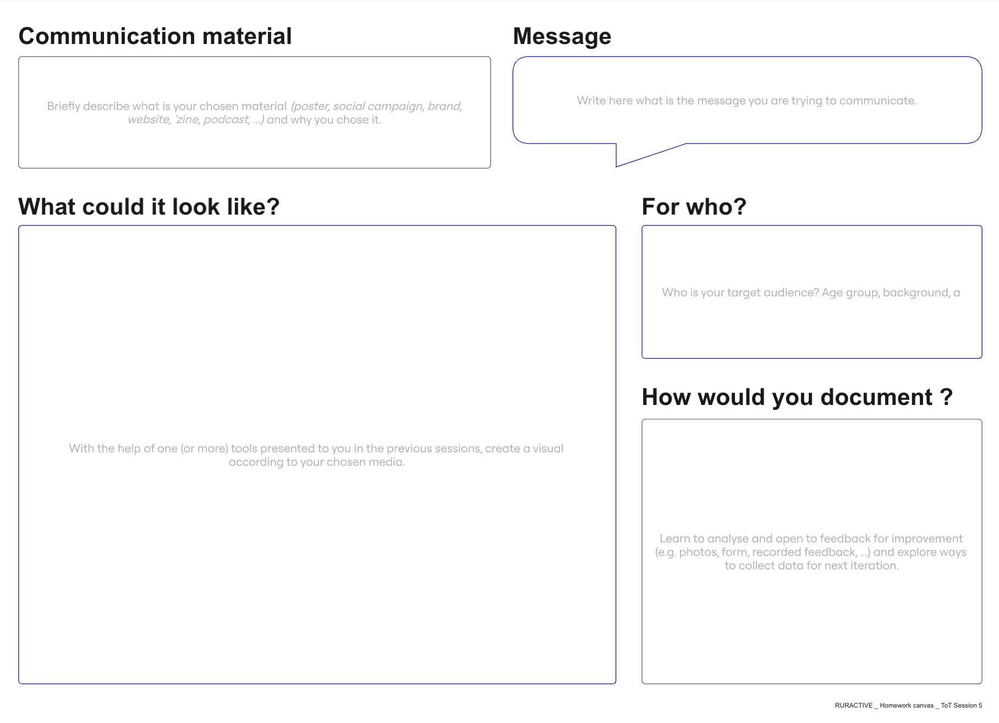

# SESSION 5

## Digital Content Creation - From Data to Story

This session will explore the potential of open data and data visualization to enhance communication and engagement in community projects. Through different presentations and a hands-on activity, participants will gain insights into how documentation and storytelling can make their initiatives more visible, accessible, and impactful.

- Co-development of solutions in rural innovation ecosystems for inclusive community led development​: Introducing WP4 of Ruractive and how it connects with the work of the Local Community Trainers in WP3. This should help participants see synergies and collaboration opportunities.

- Intro to Open Data & Visualization: A short introduction on how open data and visualization can help build narratives and engage communities.

- Documentation & Storytelling: More than just tools, this session will focus on strategies to structure and communicate information effectively in community projects.

- Practical session: Participants will split into groups to reflect on engagement strategies and how to document and visualize their projects.

## Video

## Task 5 

!!! warning "Communication strategy"

    

    1. Think of actions that build community engagement (what are the challenges? objective(s)? and what kind of actions can contribute to a potential solution?) - Add post-it notes to your space.
    
    

    2. Create a communication material (newsletter, poster, website...)    

