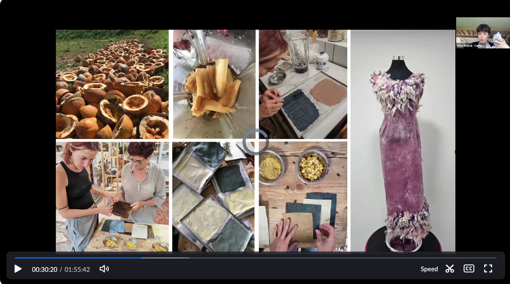
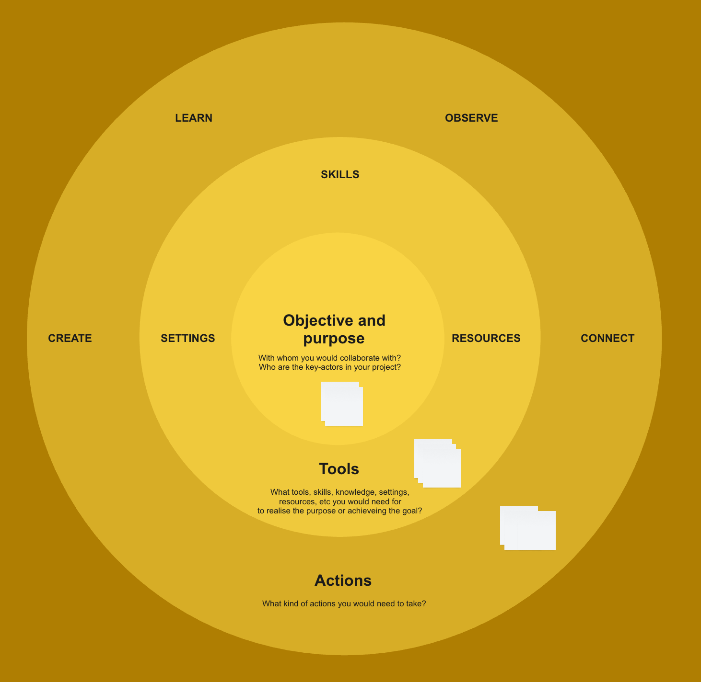

# SESSION 6

## Sustainable Innovation - Digital Tools and Maker Practices

The session will explore how sustainable design and maker practices can empower rural communities, fostering collaboration and local innovation. Participants will gain insights into how these approaches strengthen citizen engagement, build resilient communities, and help bridge the digital divide. Additionally, the session will highlight how integrating sustainability with digital problem-solving can drive inclusive and regenerative development, ensuring that rural areas have the tools to thrive in a rapidly changing world.

- 🌱 Sustainable Design – Strategies for resilience and regeneration.

- 🤝 Community Empowerment – Strengthening collaboration and local engagement.

- 💡 Digital Inclusion – Bridging the digital divide through participatory approaches.

- 🔧 Maker Practices – Hands-on learning for innovation and sustainability.

- 🌍 Holistic Solutions – Combining digital tools and sustainability for impact, to create inclusive and innovative local solutions.

By integrating these approaches, we aim to rethink technology as a catalyst for social transformation rather than just a technical solution. Through sustainable design, local traditions and resources can be transformed into collaborative projects that build community, enhance resilience, and foster long-term positive impact.

## Video

## Task 6 

!!! warning "Regenerative strategies"

    

    1. In this exercise, you will identify which skills, knowledge and resources are important for your future steps towards the implementation of sustainable practices.
 
