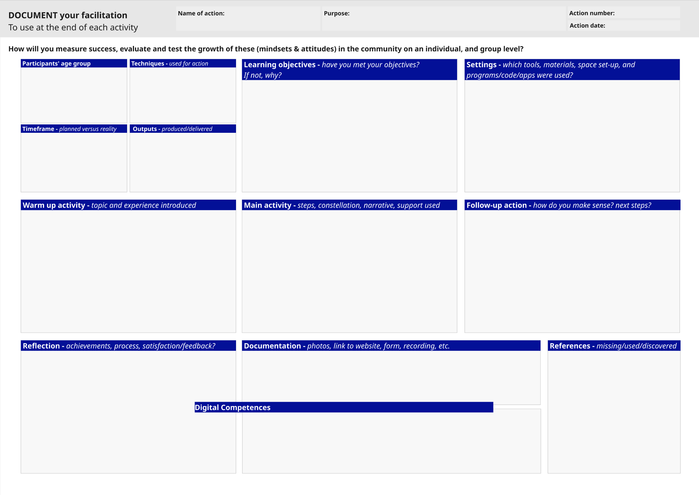

# SESSION 7

## Knowlage transfer workshop - Drafting Microsolutions roadmap

This hybrid session brought together Local Community Trainers (LCTs) to co-design the next phase of community-based learning (microsolutions). Together, participants explored frameworks for developing impactful 20-hour training programs, tailored to local needs and realities. The session fostered a collaborative environment where trainers could align on shared goals, understand each other's timelines and event structures, and provide constructive feedback on the Training of Trainers (ToT) process.

🗺️ Action Plan Co-Design – Drafting the first iteration of tailored 20h training for communities.

🧩 Design Frameworks – Learning new methodologies for structuring community-based learning.

🕰️ Common Ground – Mapping out local event schedules and aligning processes across LCTs.

🗣️ Peer Exchange – Sharing reflections and feedback on the ToT experience.

🌍 Local Impact – Laying the foundation for meaningful, community-driven engagement across territories.

## Video

## Task 7 

!!! warning "Roadmap design"

    

    1. Design a roadmap for a 20-hour training with local communities, outlining key actions, responsible stakeholders, timeline (April to December), required resources, and communication flow.

    

    2. Fill out the facilitation canvas for each of the actions included in your intervention plan.
 
