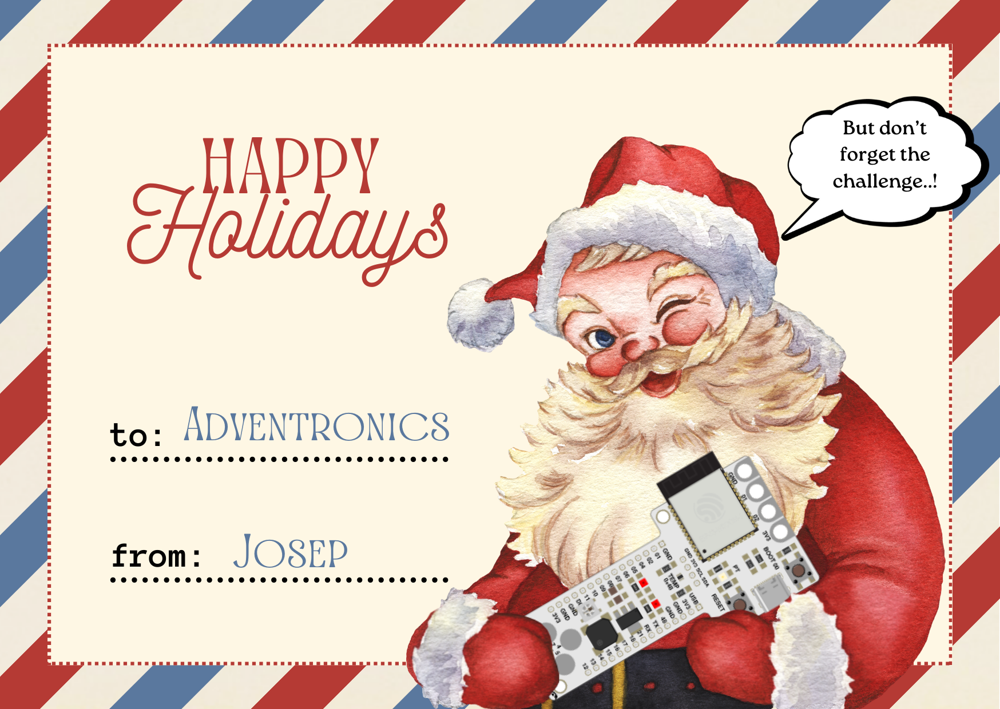

# Day six:

Sending Christmas cards it's a classic, you have to make sure you send them on time for Christmas (yes, an email is faster, but in paper is something cute and by email it's just spam... and you know it!). So we wanted to help you, the challenge today it's just to create a Christmas postcard with the Barduino on it!   :party_popper:

Extra points if you send them in paper! 

## Hero shot

