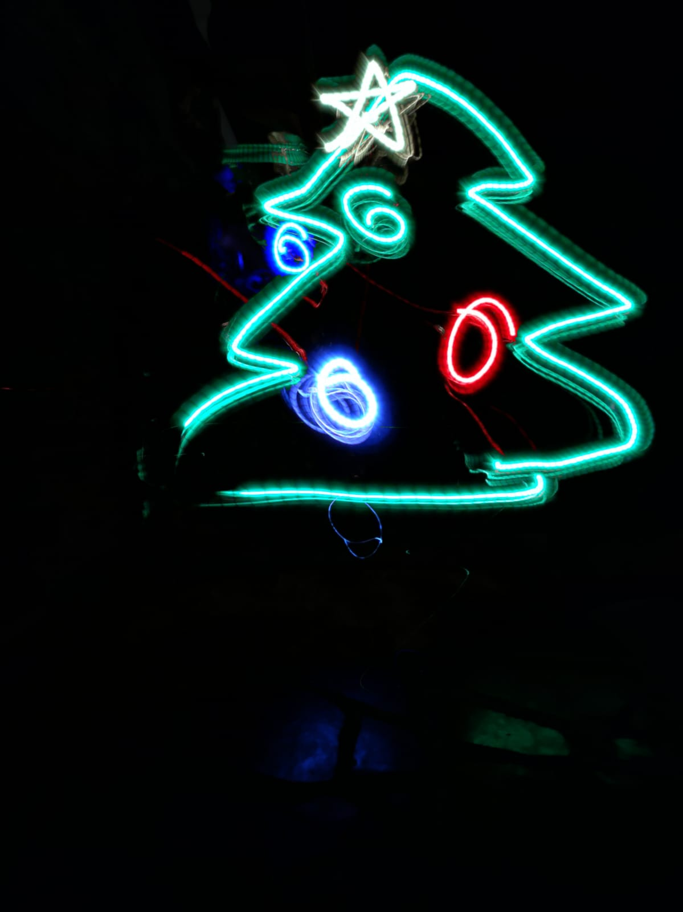

# Day nine:

LED's get artistic..! Today's callenge is to do light painting using the Barduino. You can use the Neopixel to get different colors!

To capture the image you can use this apps for [Android](https://play.google.com/store/apps/details?id=com.risingcabbage.hd.camera&hl=en&gl=US) and [Iphone](https://apps.apple.com/us/app/camtrails-light-painter/id1547281692).


## Possible solution!

### Arduino code

```c++
#include <Adafruit_NeoPixel.h>
#define PIN 38
#define NUMPIXELS 1

Adafruit_NeoPixel pixels(NUMPIXELS, PIN, NEO_GRB + NEO_KHZ800);

const int but = 0;

int state = 0;
bool pressed = 0;
bool color = false;

int hue = 0;

void setup() {
  pixels.begin();
  pixels.setBrightness(64);
  pinMode(but, INPUT);
}

void loop() {
  if (!digitalRead(but) && !pressed) {
    pressed = true;
    color = !color;
    if (color) {
      state = state + 1;
      if (state > 4) {
        state = 0;
      }
      Serial.println(state);
    }
  } else if (digitalRead(but)) {
    pressed = false;
  }
  if (color) {
    switch (state) {
      case 0:
        pixels.setPixelColor(0, pixels.Color(255, 0, 0));
        break;
      case 1:
        pixels.setPixelColor(0, pixels.Color(255, 200, 0));
        break;
      case 2:
        pixels.setPixelColor(0, pixels.Color(255, 255, 255));
        break;
      case 3:
        pixels.setPixelColor(0, pixels.Color(0, 255, 0));
        break;
      case 4:
        pixels.setPixelColor(0, 0, 0, 255);
        break;
      default:
        break;
    }
  } else {
    pixels.setPixelColor(0, 0, 0, 0);
  }
  pixels.show();
}
```

## Hero shot

