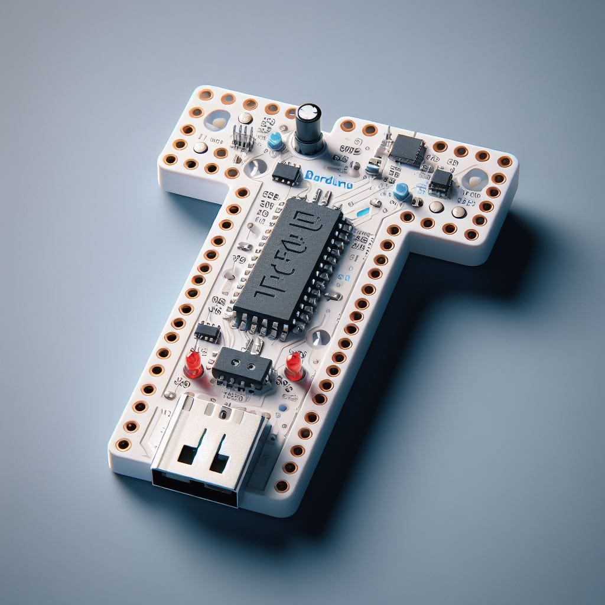

# Day seventeen:

Use an AI image generator to create an image of the Barduino. Let's see how AI imagines our board!

If you want, you can also share te prompt!

## Hero shot

Prompt: give me a photorealistic image of the Barduino, an electronic development board shaped like a T. it's white, it works with an esp32s3 and it has usb c connector. It has a neopixel, 2 red LEDs , a buzzer, 2 pushbuttons, a temperature sensor and a phototransistor. it also have in the lower part of the T 4 capacitive pins in the shape of a + simbol.

Using DALL·E3